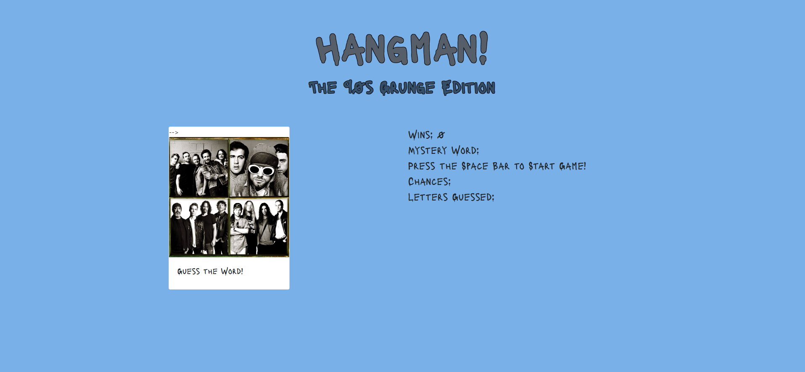

# Word-Guess-Game

https://kdacanay.github.io/Word-Guess-Game/

**HangMan! The 90s Grunge Edition**

In this assignment, you'll create one of two possible computer games: Word Guess or Psychic. These apps will run in the browser, and feature dynamically updated HTML and CSS powered by your JavaScript code.

Choose a theme for your game! In the demo, we picked an 80s theme: 80s questions, 80s sound and an 80s aesthetic. You can choose any subject for your theme, though, so be creative!

* Use key events to listen for the letters that your players will type.

* Display the following on the page:

* Press any key to get started!

* Wins: (# of times user guessed the word correctly).

* If the word is madonna, display it like this when the game starts: _ _ _ _ _ _ _.

* As the user guesses the correct letters, reveal them: m a d o _  _ a.

* Number of Guesses Remaining: (# of guesses remaining for the user).

* Letters Already Guessed: (Letters the user has guessed, displayed like L Z Y H).

* After the user wins/loses the game should automatically choose another word and make the user play it.

* Word Guess Game Bonuses

* Play a sound or song when the user guesses their word correctly, like in our demo.

* Write some stylish CSS rules to make a design that fits your game's theme.

* HARD MODE: Organize your game code as an object, except for the key events to get the letter guessed. This will be a challenge if you haven't coded with JavaScript before, but we encourage anyone already familiar with the language to try this out.
* Save your whole game and its properties in an object.
* Save any of your game's functions as methods, and call them underneath your object declaration using event listeners.
* Don't forget to place your global variables and functions above your object.
* Remember: global variables, then objects, then calls.

As with all projects, I began by pseudocoding a possible solution.  I starte with an array of mystery words, each mystery word is an object with a matching image.  Then I made several variables to be used throughout the game.  I used JQeury selectors to detect the user selections.  A random number is picked to decide which word is used first using Math.random method. Ater each word is picked, the word's letters is split (using .split("")), and then those letters become blanks.  When a letter is selected, a for loop is ran to check if a blank letter is solved or not, if solved a blank reveals to be a letter or the letter is pushed to the wrongGuesses array, which is also displayed.  User has 10 chances to guess the word.  If guessed within the 10 chances, an image of the band or one related to the answer ,is displayed along with a grunge audio file is played (obviously, i had problems with copyrights to use the bands actual song).  An additional audio file is played if user: runs out of chances, or answers 10 words correctly.  
